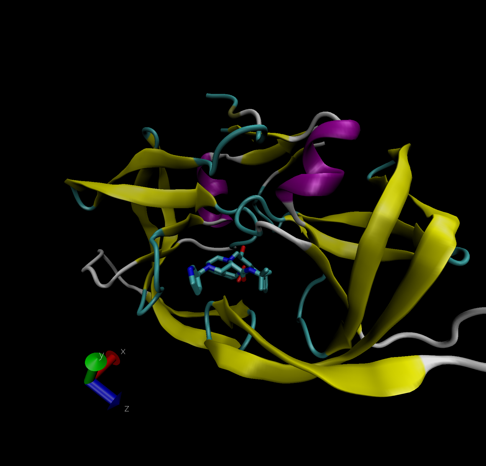
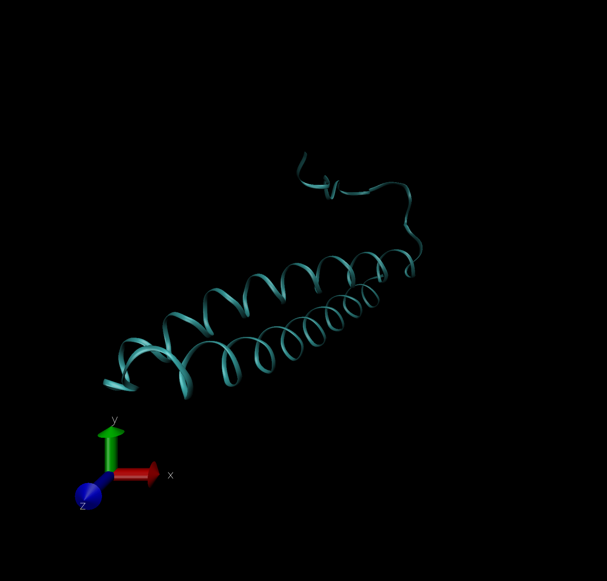

Import the data set from the PBD. Download and then add to working directory file. Location of data <https://www.rcsb.org/stats/summary>

SEt the row names as equal to the first row

```{r}
tbl<-read.csv("Data Export Summary.csv", row.names = 1)
tbl
```

## Q1: What percentage of structures in the PDB are solved by X-Ray and Electron Microscopy.

```{r}
#First try- didn't sum column so not right
((tbl$X.ray + tbl$EM)/ tbl$Total)*100

#Summing the entire columns
((sum(tbl$X.ray + tbl$EM))/sum(tbl$Total))*100 

#Using colSums- best method
n.type<-colSums(tbl)
ans <- round(n.type/n.type["Total"]*100, digits = 3 )
ans
```

The proportion or percent of Xray structures is `r ans[1]`%

## Q2: What proportion of structures in the PDB are protein?

```{r}
#First way to get the value of protein total in total column
tbl$Total[1]

#Second method adding everything up
protein.total <- tbl["Protein (only)", "Total"]/n.type["Total"]*100
protein.total
```

The proportion of structure in the PDB are protein is `r protein.total`%

# Inserting image file



## Q3: Type HIV in the PDB website search box on the home page and determine how many HIV-1 protease structures are in the current PDB?

The search results showed 8427 results

## Q4: Water molecules normally have 3 atoms. Why do we see just one atom per water molecule in this structure?

The resolution for the PMD is 2 A. Hydrogen is much smaller than this resolution therefore we cannot see it.

## Q5: There is a conserved water molecule in the binding site. Can you identify this water molecule? What residue number does this water molecule have (see note below)?

MK 1902

## Bio3D for structural bioinformatics

```{r}
library(bio3d)

pdb <- read.pdb("1hsg")
pdb
```

## Q7: How many amino acid residues are there in this pdb object?

198 

## Q8: Name one of the two non-protein residues? 

Water H20 

## Q9: How many protein chains are in this structure? 

2


```{r}
#Converts the three letter protein code to one letter code
aa321("GLN")
```

```{r}
head(pdb$atom)
```

## Q10. Which of the packages above is found only on BioConductor and not CRAN?

MSA

## Q11. Which of the above packages is not found on BioConductor or CRAN?: 

bitbucket 

## Q12. True or False? Functions from the devtools package can be used to install packages from GitHub and BitBucket? 

TRUE

## Comparative analysis of protein structures

Read a single ADK structure from the database

```{r}
aa <- get.seq("1ake_A")
aa
```

## Q13. How many amino acids are in this sequence, i.e. how long is this sequence?

214 amino acids

# Let's find related sequences to 'aa' using blast.pdb

```{r}
#blast <- blast.pdb(aa)
```

Plot the blast search to see the graphs of E-values and top hits. Save it to a vector to look at the results more.

```{r}
#hits <- plot(blast)
#hits
```

Show the names of all the hits from the blast search

```{r}
#hits$pdb.id
```

## Alpha fold predicted protein for ROMO1




