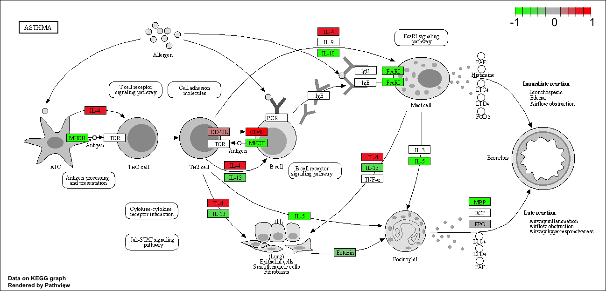

#RNAseq analysis from Asthma study Himes et. al.

```{r}
#install.packages("BiocManager")
#BiocManager::install("DESeq2")
#library(BiocManager)
#library(DESeq2)
```

#Import data set, countData and colData

```{r}
counts <- read.csv("airway_scaledcounts.csv", row.names=1)
metadata <-  read.csv("airway_metadata.csv")
```

# Look at the data

```{r}
head(counts)
```

```{r}
head(metadata)
```

# Q1. How many genes are in this dataset?

```{r}
nrow(counts)
```

There are 38694 genes

# Q2. How many 'control' cell lines do we have?

```{r}
metadata$dex
```

There are 4 control cell lines

# Make sure the control id from the count and metadata match

```{r}
metadata$id == colnames(counts)
```

```{r}
all(c(T, F, T)) #how the all function works
```

Test the 'all()' function on the conditional argument we wrote

```{r}
if(all(metadata$id == colnames(counts))){
  cat("yep")
} 
```

# Compare control vs treated cell lines

```{r}
control <- metadata[metadata$dex =="control",] #subset control data from the metadata set
head(control)
```

```{r}
control.counts <- counts[ ,control$id] #extract control ids from the count data
head(control.counts)
```

# Q3. How would you make the above code in either approach more robust? Because we are sub-setting the metadata and the count data by row labels it works for larger datasets too. If we were only working with column locations that may change with different datasets. Also we put the subsetted information into a vector to store all the data we pulled out, opposed to just printing out the entire dataset.

# Get treated experiments too, using a similar method to control

```{r}
treated <- metadata[metadata$dex =="treated",]
treated.counts <- counts[ ,treated$id]
head(treated.counts)
```

# Find the means of treated and control experiments

```{r}
control.mean <- rowMeans( control.counts ) 
head(control.mean)
```

# Q4. Follow the same procedure for the treated samples (i.e. calculate the mean per gene across drug treated samples and assign to a labeled vector called treated.mean)

```{r}
treated.mean <- rowMeans( treated.counts )
head(treated.mean)
```

# Combine the two datasetts for plotting

```{r}
meancounts <- data.frame(control.mean, treated.mean)
head(meancounts)
```

# Q5 (a). Create a scatter plot showing the mean of the treated samples against the mean of the control samples. Your plot should look something like the following.

```{r}
plot(treated.mean, control.mean)
```

# Q5 (b).You could also use the ggplot2 package to make this figure producing the plot below. What geom\_?() function would you use for this plot?

```{r}
library(ggplot2)
ggplot(meancounts, aes(treated.mean, control.mean)) +
  geom_point()
```

# Q6. Try plotting both axes on a log scale. What is the argument to plot() that allows you to do this?

```{r}
plot(treated.mean, control.mean, log="xy")
```

We often use log 2 transformation, because it indicates fold change

```{r}
log2(80/20)
```

log2 fold change on data

```{r}
log2fc<- log2(treated.mean/control.mean)
plot(log2fc)
```

Put all our data in a data.frame

```{r}
meancounts <- data.frame(control.mean, treated.mean, log2fc)
head(meancounts)
```

# Q7. What is the purpose of the arr.ind argument in the which() function call above? Why would we then take the first column of the output and need to call the unique() function?

arr.ind is logical; should array indices be returned when x is an array? So it sorts the matching info into an array with the row and column locations

Get rid of 0s and infinities

```{r}
zero.vals <- which(meancounts[,1:2]== "0", arr.ind = TRUE) #use which function to find the 0s and return them into a logical array with the row locations
head(zero.vals)
```

Find the unique rows with these 0s

```{r}
to.rm <- unique(which(meancounts[,1:2]== "0", arr.ind = TRUE)[,"row"]) #genes to exclude sorted by the rows locations that are 0
mycounts <- meancounts[-to.rm,] #remove the vector with the 0s
head(mycounts)
```

# Genes left after removing the ones with 0s

```{r}
nrow(mycounts)
```

# Q8. Using the up.ind vector above can you determine how many up regulated genes we have at the greater than 2 fc level?

```{r}
up.ind <- mycounts$log2fc > 2
sum(up.ind)
```

# Q9. Using the down.ind vector above can you determine how many down regulated genes we have at the greater than 2 fc level?

```{r}
down.ind <- mycounts$log2fc< (-2)
sum(down.ind)
```

# Q10. Do you trust these results? Why or why not?

Not entirely. These differences in the mean may not be statistically significant based on many factors. The control could be skewed by low sample size for example. We should probably do more summary statistics for both groups before determining significance.

# Use DESeq2 for these summary statistics on this dataset

```{r}
library(DESeq2)
#citation("DESeq2")
```

Create a DESeq data matrix with our data

```{r}
dds <- DESeqDataSetFromMatrix(countData=counts, 
                              colData=metadata, 
                              design=~dex) #how are we comparing the data look at the dex column for the control vs treated
dds
```

```{r}
dds <- DESeq(dds)
res <- results(dds)
res
```

# Main results figure as a volcano plot

Log2 fold change vs p- value

```{r}
plot(res$log2FoldChange, res$padj)
```

Log transformation of this plot

```{r}
plot(res$log2FoldChange, log(res$padj))
```

Flip the plot by putting a - in front of our log padj

```{r}
plot(res$log2FoldChange, -log(res$padj))
```

```{r}
mycols <- rep("gray", nrow(res))
mycols[ abs(res$log2FoldChange) > 2 ]  <- "deeppink"
inds <- (res$padj < 0.01) & (abs(res$log2FoldChange) > 2 )
mycols[ inds ] <- "dodgerblue2"
plot(res$log2FoldChange, -log(res$padj), col= mycols)

# Cut-off lines
abline(v=c(-2,2), col="gray", lty=2)
abline(h=-log(0.1), col="gray", lty=2)
```

# Add annotation data

Install all the proper packages

```{r}
#BiocManager::install("EnhancedVolcano")
library(EnhancedVolcano)
```

```{r}
library(AnnotationDbi)
#BiocManager::install("org.Hs.eg.db")
library(org.Hs.eg.db)
```

Now use 'mapIDs()" function from the AnnotationDbi package to find

```{r}
#First what is available 
columns(org.Hs.eg.db)
```

```{r}
res$symbol <- mapIds(org.Hs.eg.db,
                     keys=row.names(res),      # Our genenames
                     keytype="ENSEMBL",        # The format of our genenames
                     column="SYMBOL",          # The new format we want to add
                     multiVals="first")
head(res)
```

# Q11. Run the mapIds() function two more times to add the Entrez ID and UniProt accession and GENENAME as new columns called res$entrez, res$uniprot and res\$genename.

Add in all of these new columns based on the mapID function

```{r}
res$genename <- mapIds(org.Hs.eg.db,
                     keys=row.names(res),      # Our genenames
                     keytype="ENSEMBL",        # The format of our genenames
                     column="GENENAME",          # The new format we want to add
                     multiVals="first")
head(res)
```

```{r}
res$entrez <- mapIds(org.Hs.eg.db,
                     keys=row.names(res),      # Our genenames
                     keytype="ENSEMBL",        # The format of our genenames
                     column="ENTREZID",          # The new format we want to add
                     multiVals="first")
head(res)
```

```{r}
res$uniprot <- mapIds(org.Hs.eg.db,
                     keys=row.names(res),      # Our genenames
                     keytype="ENSEMBL",        # The format of our genenames
                     column="UNIPROT",          # The new format we want to add
                     multiVals="first")
head(res)
```

```{r}
library(pathview)
library(gage)
library(gageData)
```

```{r}
data(kegg.sets.hs)

# Examine the first 2 pathways in this kegg set for humans
head(kegg.sets.hs, 2)
```

```{r}
foldchanges = res$log2FoldChange
names(foldchanges) = res$entrez
head(foldchanges)
```

Now we can run gene set enrichment (aka pathway analysis) We can find out what keggres is using the 'attributes()' function

```{r}
# Get the results
keggres = gage(foldchanges, gsets=kegg.sets.hs)
attributes(keggres)
```

First look at the downregulated list (less)

```{r}
# Look at the first three down (less) pathways
head(keggres$less, 3)
```

```{r}
pathview(gene.data=foldchanges, pathway.id="hsa05310")

```



```{r}
# A different PDF based output of the same data
pathview(gene.data=foldchanges, pathway.id="hsa05310", kegg.native=FALSE)
```

Save the results to a CSV
```{r}
write.csv(res, file= "deq_results.csv")
```

